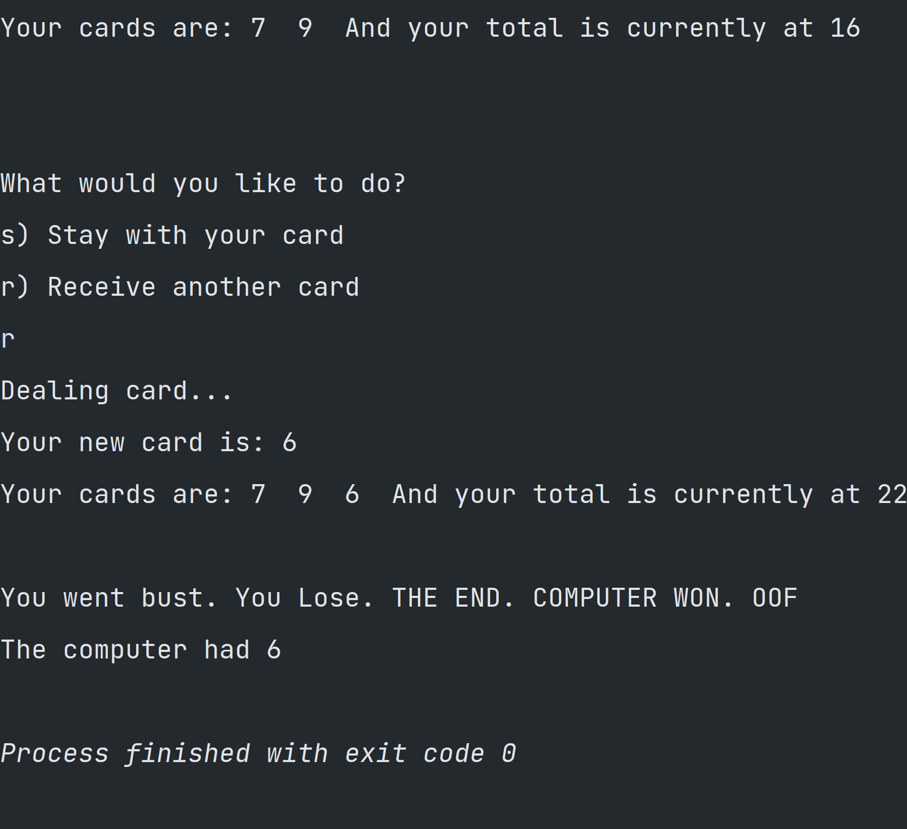
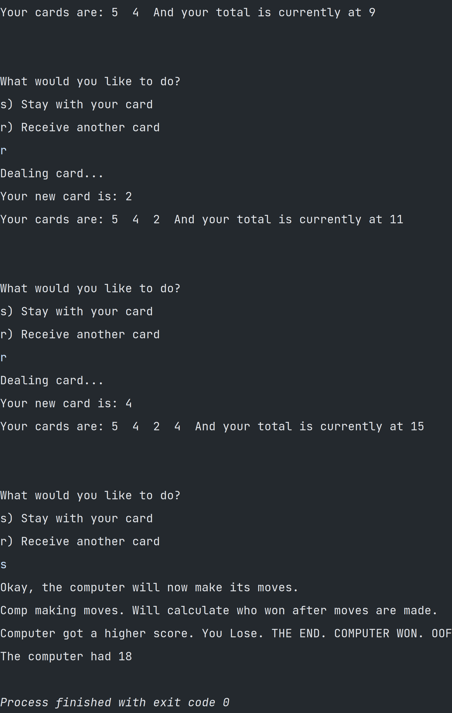

# Blackjack
A BlackJack game!
The user can play a simple game of blackjack against the computer.
Play at https://replit.com/@chaitran77/Blackjack#

Tests:

Player Bust:

Player Win: 

Computer Win:

Player Win, play again, bust, exit:

<!-- !
]

Player Win:

Computer Win:

-->
